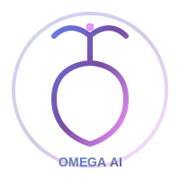

# 🚀 Omega AI Desktop



**Multi-Model AI Coding Assistant for Ubuntu**

A powerful desktop application that combines multiple free AI models with intelligent routing to provide the best coding assistance available.

## 🎯 One-Click Start/Stop

### Start the Application
```bash
cd /workspace/omega-ai
./start.sh
```

### Stop the Application
```bash
./stop.sh
```

## ✨ Features

### 🤖 6 Premium Free AI Models
| Model | Accuracy | Speed | Best For | Provider |
|-------|----------|-------|----------|----------|
| **Qwen3-Coder** | ⭐⭐⭐⭐⭐ | ⭐⭐⭐⭐ | Coding, Code Review | OpenRouter |
| **DeepSeek-V3** | ⭐⭐⭐⭐⭐ | ⭐⭐⭐⭐ | Debugging, Testing | Together AI |
| **Kimi K2** | ⭐⭐⭐⭐⭐ | ⭐⭐⭐ | Architecture, Design | Moonshot AI |
| **Llama 4** | ⭐⭐⭐⭐ | ⭐⭐⭐⭐ | General Questions | Groq |
| **Gemma 3** | ⭐⭐⭐⭐ | ⭐⭐⭐⭐⭐ | Fast Responses | Groq |
| **Mistral Small** | ⭐⭐⭐⭐ | ⭐⭐⭐⭐⭐ | Summaries | Groq |

### 🧠 Smart AI Router
Automatically detects task type and routes to the best model:
- **Coding tasks** → Qwen3-Coder
- **Debugging** → DeepSeek-V3
- **Architecture** → Kimi K2
- **General** → Llama 4
- **Quick responses** → Gemma 3 or Mistral Small

### 🎨 Beautiful UI Features
- Animated Omega AI logo with glow effects
- Dark theme with gradient accents
- Responsive sidebar navigation
- Built-in Help documentation (press F1)
- Markdown support with syntax highlighting
- Alternative response display

### 🛠️ Developer Tools
- File Explorer - Browse, read, edit code files
- Integrated Terminal - Execute commands securely
- Memory System - Conversation history & context
- Multi-model chat - Get multiple AI perspectives

## 📦 Installation

### 1. Install Dependencies
```bash
cd /workspace/omega-ai
npm install
cd backend && npm install
cd ../frontend && npm install
cd ..
```

### 2. Configure API Keys
```bash
cp .env.example .env
```

Edit `.env` and add your free API keys from:
- [OpenRouter](https://openrouter.ai) - For Qwen3-Coder
- [Groq](https://groq.com) - For Llama 4, Gemma 3, Mistral Small
- [Together AI](https://together.xyz) - For DeepSeek-V3
- [Moonshot AI](https://moonshot.ai) - For Kimi K2
- [Hugging Face](https://huggingface.co) - For CodeLlama, StarCoder2

### 3. Run the Application
```bash
./start.sh
```

The Electron app window will open automatically!

## 🏗️ Architecture

```
┌───────────────────────┐
│   React + Electron    │
│      Frontend UI      │
└──────────┬────────────┘
           │
           ▼
┌───────────────────────┐
│     AI Router         │
│  (Smart Task Detection)│
└──────────┬────────────┘
           │
    ┌──────┼──────┐
    ▼      ▼      ▼
┌──────┐ ┌──────┐ ┌──────┐
│Qwen3 │ │Deep  │ │ Kimi │
│Coder │ │Seek  │ │  K2  │
└──────┘ └──────┘ └──────┘
           │
    Best Response Selector
           │
           ▼
    Return to UI
```

## ⌨️ Keyboard Shortcuts

| Shortcut | Action |
|----------|--------|
| `F1` | Open Help Documentation |
| `Ctrl + N` | New Chat |
| `Ctrl + Enter` | Send Message |
| `Ctrl + ,` | Open Settings |
| `Esc` | Close Panel |

## 📁 Project Structure

```
omega-ai/
├── assets/                 # Logo and images
│   └── logo.svg           # Animated Omega AI logo
├── backend/               # Node.js Express server
│   ├── ai/               # AI Router & model integrations
│   │   └── router.js     # Smart task detection & routing
│   ├── routes/           # API endpoints
│   ├── services/         # Business logic
│   └── server.js         # Main server file
├── frontend/              # React + Vite + Electron
│   ├── electron/         # Electron main process
│   ├── public/           # Static assets
│   │   └── assets/
│   │       └── logo.svg
│   ├── src/
│   │   ├── components/   # React components
│   │   │   ├── Sidebar.jsx
│   │   │   ├── ChatPanel.jsx
│   │   │   ├── ModelSelector.jsx
│   │   │   ├── FileExplorer.jsx
│   │   │   └── TerminalPanel.jsx
│   │   ├── pages/        # Page components
│   │   │   └── HelpPage.jsx
│   │   └── App.jsx       # Main app component
│   └── package.json
├── logs/                  # Application logs
├── start.sh               # One-click start script
├── stop.sh                # One-click stop script
├── .env.example           # Environment variables template
└── README.md              # This file
```

## 🔧 Troubleshooting

### App won't start?
```bash
./stop.sh    # Clean up any running processes
./start.sh   # Start fresh
```

### Check logs for errors
```bash
cat logs/backend.log
```

### API key errors?
Make sure you've copied `.env.example` to `.env` and added valid API keys.

### Need help?
Press `F1` in the app or click the **Help (?)** button in the sidebar for detailed documentation!

## 📝 License

MIT License - Free for personal and commercial use.

---

**Built with ❤️ for Ubuntu Desktop**

*Combining the best free AI models to create the ultimate coding assistant.*
